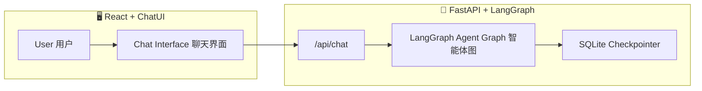

# 🧠 LumaWell — AI-Powered Health & Wellness Assistant  
健康与生活方式智能助理系统

[](https://www.python.org/)  
[](https://fastapi.tiangolo.com/)  
[](https://github.com/langchain-ai/langgraph)  
[](https://react.dev/)  
[](LICENSE)

---

## 📚 Table of Contents / 目录
- [Overview / 项目概述](#overview--项目概述)
- [Architecture / 系统架构](#architecture--系统架构)
- [Tech Stack / 技术栈](#tech-stack--技术栈)
- [Installation / 安装与运行](#installation--安装与运行)
- [API Reference / 接口文档](#api-reference--接口文档)
- [Agent Graph / 智能体结构](#agent-graph--智能体结构)
- [Environment Variables / 环境变量](#environment-variables--环境变量)
- [Frontend / 前端交互逻辑](#frontend--前端交互逻辑)
- [Project Structure / 项目结构](#project-structure--项目结构)
- [Example Interaction / 示例对话](#example-interaction--示例对话)
- [Development Notes / 开发说明](#development-notes--开发说明)
- [License / 许可证](#license--许可证)

---

## 🧭 Overview / 项目概述
LumaWell is an intelligent conversational system for **personal health and lifestyle guidance**, built with **LangGraph multi-agent orchestration** and a **React + ChatUI frontend**.

LumaWell 是一个健康与生活方式智能助理，通过 **LangGraph 多智能体推理** 与现代化的 **React 聊天界面**，实现健康问答、运动建议、营养指导、心理与环境分析。

---

## 🏗 Architecture / 系统架构

| Layer 层级 | Description 描述 | Stack 技术栈 |
|-------------|------------------|---------------|
| **Backend (API)** | FastAPI server orchestrating LangGraph agents for health reasoning.<br>基于 FastAPI 的 LangGraph 多智能体后端。 | Python, FastAPI, LangGraph, SQLite |
| **Frontend (UI)** | React-based full-screen chat interface with ChatUI + Tailwind.<br>基于 React 的全屏聊天界面。 | React, TypeScript, Vite, TailwindCSS |



---

## 🧰 Tech Stack / 技术栈

### Backend
- `FastAPI` — RESTful API framework  
- `LangGraph` — Multi-agent orchestration  
- `LangChain Core` — Message & state management  
- `SentenceTransformers`, `Torch`, `scikit-learn` — NLP & Embedding  
- `SQLite` — Persistent checkpoint storage  

### Frontend
- `Vite` + `React` + `TypeScript`  
- `ChatUI` — Conversational interface  
- `TailwindCSS` — Utility-first styling  
- `Framer Motion`, `Lucide-React` — Animation & Icons  

---

## ⚙ Installation / 安装与运行

### Backend
```bash
cd lumawell_Backend
python -m venv .venv
.venv\Scripts\activate      # Windows
# or: source .venv/bin/activate (Mac/Linux)
pip install -r requirements.txt
cp .env.example .env
uvicorn server:app --reload
```
➡ **http://localhost:8000**

### Frontend
```bash
cd lumawell-ui
npm install
npm run dev
```
➡ **http://localhost:5173**

---

## 🌐 API Reference / 接口文档

### `POST /chat`  
> Main conversational endpoint / 主对话接口

**Request**
```json
{
  "thread_id": "string",
  "message": "User message",
  "city": "optional",
  "realtime": true
}
```

**Response**
```json
{
  "reply": "AI generated response",
  "route": "nutrition",
  "sources": ["[1] food_guidelines.pdf"],
  "tools": [{"name": "BMI_Calculator", "output": "22.3"}]
}
```

**Example**
```bash
curl -X POST http://localhost:8000/chat   -H "Content-Type: application/json"   -d '{"thread_id":"demo","message":"What should I eat after running?"}'
```

---

### `GET /health`
> Health check endpoint / 健康检查接口
```bash
curl http://localhost:8000/health
# {"status":"ok"}
```

---

## 🧩 Agent Graph / 智能体结构

| Node 节点 | Description 功能 |
|------------|----------------|
| `router_node` | Routes user intent / 意图路由 |
| `fitness_agent_node` | Exercise & training / 健身建议 |
| `nutrition_agent_node` | Diet & calories / 营养指导 |
| `mind_agent_node` | Mental health / 心理健康 |
| `medical_agent_node` | Medical reasoning / 医疗问答 |
| `environment_agent_node` | Weather & context / 环境信息 |
| `safety_node` | Ethical & safe outputs / 安全检查 |
| `rag_node` | Retrieval-augmented responses / 检索增强 |

Persistent storage: **SQLite** → fallback to in-memory checkpoints。

---

## 🧾 Environment Variables / 环境变量

| Key | Description / 说明 |
|-----|---------------------|
| `OPENAI_API_KEY` | API key for LLM provider / 模型服务 API 密钥 |
| `LANGCHAIN_TRACING_V2` | Optional tracing flag / 调试追踪开关 |
| `LANGCHAIN_ENDPOINT` | LangSmith / tracing endpoint / 日志服务地址（可选） |

---

## 💬 Frontend / 前端交互逻辑

- **ChatUI v3** message bubbles  
- Avatar display (`bot.png`, `user.png`)  
- Typing animation “对方正在输入…”  
- Thread ID saved to `localStorage`  
- Smooth UX by replacing typing bubble via `updateMsg()`  

---

## 📂 Project Structure / 项目结构
```
lumawell/
├── lumawell_Backend/
│   ├── main.py
│   ├── server.py
│   ├── requirements.txt
│   ├── healthbot.db
│   ├── .env.example
│   └── graph/
│       └── nodes/...
└── lumawell-ui/
    ├── src/
    │   ├── App.tsx
    │   ├── main.tsx
    │   └── index.css
    ├── package.json
    └── tailwind.config.js
```

---

## 🧠 Example Interaction / 示例对话

**User 用户：**  
> “Calculate my daily calorie needs for moderate exercise.”  
> “计算我中等运动强度的每日热量需求。”

**Agent Flow 智能体流程：**  
`router → tools (TDEE calculator) → reply`

**Response 回复：**  
> “Your estimated TDEE is 2,400 kcal/day.”  
> “根据中等活动水平，你的每日总能量消耗约为 2,400 千卡。”

---

## 🧑‍💻 Development Notes / 开发说明
- Conversations identified by `thread_id`  
- `/reset`, `/exit` commands supported in CLI mode (`main.py`)  
- Default checkpoint: SQLite → Memory fallback  
- Safety agent ensures medically safe responses  

---

## 📜 License / 许可证
**MIT License © 2025 LumaWell Contributors**

---

✨ *Developed with ❤️ using LangGraph + FastAPI + React.*  
✨ *由 LangGraph + FastAPI + React 驱动的智能健康助手。*
