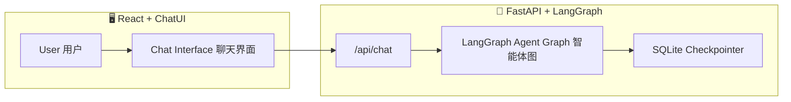

# 🧠 LumaWell — AI-Powered Health & Wellness Assistant  
健康与生活方式智能助理系统

[](https://www.python.org/)  
[](https://fastapi.tiangolo.com/)  
[](https://github.com/langchain-ai/langgraph)  
[](https://react.dev/)  
[](LICENSE)

---

## 📚 Table of Contents / 目录
- [Overview / 项目概述](#overview--项目概述)
- [Architecture / 系统架构](#architecture--系统架构)
- [Installation / 安装与运行](#installation--安装与运行)
- [API Reference / 接口文档](#api-reference--接口文档)
- [Backend Internals / 后端内部实现](#-backend-internals--后端内部实现)
- [Hybrid Retriever / 混合检索器](#-hybrid-retriever--混合检索器)
- [Environment Variables / 环境变量](#-environment-variables--环境变量)
- [Frontend / 前端交互逻辑](#-frontend--前端交互逻辑)
- [Project Structure / 项目结构](#-project-structure--项目结构)
- [Example Interaction / 示例对话](#-example-interaction--示例对话)
- [Development Notes / 开发说明](#-development-notes--开发说明)
- [License / 许可证](#-license--许可证)

---

## 🧭 Overview / 项目概述
LumaWell is an intelligent conversational system for **personal health and lifestyle guidance**, built with **LangGraph multi-agent orchestration** and a **React + ChatUI frontend**.

LumaWell 是一个健康与生活方式智能助理，通过 **LangGraph 多智能体推理** 与现代化的 **React 聊天界面**，实现健康问答、运动建议、营养指导、心理与环境分析。

---

## 🏗 Architecture / 系统架构

| Layer 层级 | Description 描述 | Stack 技术栈 |
|-------------|------------------|---------------|
| **Backend (API)** | FastAPI server orchestrating LangGraph agents for health reasoning.<br>基于 FastAPI 的 LangGraph 多智能体后端。 | Python, FastAPI, LangGraph, SQLite |
| **Frontend (UI)** | React-based full-screen chat interface with ChatUI + Tailwind.<br>基于 React 的全屏聊天界面。 | React, TypeScript, Vite, TailwindCSS |



---

## 🧰 Tech Stack / 技术栈

### Backend
- `FastAPI` — RESTful API framework  
- `LangGraph` — Multi-agent orchestration  
- `LangChain Core` — Message & state management  
- `SentenceTransformers`, `Torch`, `scikit-learn` — NLP & Embedding  
- `SQLite` — Persistent checkpoint storage  

### Frontend
- `Vite` + `React` + `TypeScript`  
- `ChatUI` — Conversational interface  
- `TailwindCSS` — Utility-first styling  
- `Framer Motion`, `Lucide-React` — Animation & Icons  

---

## ⚙ Installation / 安装与运行

### Backend
```bash
cd lumawell_Backend
python -m venv .venv
.venv\Scripts\activate      # Windows
# or: source .venv/bin/activate (Mac/Linux)
pip install -r requirements.txt
cp .env.example .env
uvicorn server:app --reload
```
➡ **http://localhost:8000**

### Frontend
```bash
cd lumawell-ui
npm install
npm run dev
```
➡ **http://localhost:5173**

---

## 🌐 API Reference / 接口文档

### `POST /chat`  
> Main conversational endpoint / 主对话接口

**Request**
```json
{
  "thread_id": "string",
  "message": "User message",
  "city": "optional",
  "realtime": true
}
```

**Response**
```json
{
  "reply": "AI generated response",
  "route": "nutrition",
  "sources": ["[1] food_guidelines.pdf"],
  "tools": [{"name": "BMI_Calculator", "output": "22.3"}]
}
```

**Example**
```bash
curl -X POST http://localhost:8000/chat   -H "Content-Type: application/json"   -d '{"thread_id":"demo","message":"What should I eat after running?"}'
```

---

### `GET /health`
> Health check endpoint / 健康检查接口
```bash
curl http://localhost:8000/health
# {"status":"ok"}
```

---

## 🧩 Agent Graph / 智能体结构

| Node 节点 | Description 功能 |
|------------|----------------|
| `router_node` | Routes user intent / 意图路由 |
| `fitness_agent_node` | Exercise & training / 健身建议 |
| `nutrition_agent_node` | Diet & calories / 营养指导 |
| `mind_agent_node` | Mental health / 心理健康 |
| `medical_agent_node` | Medical reasoning / 医疗问答 |
| `environment_agent_node` | Weather & context / 环境信息 |
| `safety_node` | Ethical & safe outputs / 安全检查 |
| `rag_node` | Retrieval-augmented responses / 检索增强 |

Persistent storage: **SQLite** → fallback to in-memory checkpoints。

---

## 🧾 Environment Variables / 环境变量

| Key | Description / 说明 |
|-----|---------------------|
| `OPENAI_API_KEY` | API key for LLM provider / 模型服务 API 密钥 |
| `LANGCHAIN_TRACING_V2` | Optional tracing flag / 调试追踪开关 |
| `LANGCHAIN_ENDPOINT` | LangSmith / tracing endpoint / 日志服务地址（可选） |

---

## 💬 Frontend / 前端交互逻辑

- **ChatUI v3** message bubbles  
- Avatar display (`bot.png`, `user.png`)  
- Typing animation “对方正在输入…”  
- Thread ID saved to `localStorage`  
- Smooth UX by replacing typing bubble via `updateMsg()`  

---

## 📂 Project Structure / 项目结构
```
lumawell/
├── lumawell_Backend/
│   ├── main.py
│   ├── server.py
│   ├── requirements.txt
│   ├── healthbot.db
│   ├── .env.example
│   └── graph/
│       └── nodes/...
└── lumawell-ui/
    ├── src/
    │   ├── App.tsx
    │   ├── main.tsx
    │   └── index.css
    ├── package.json
    └── tailwind.config.js
```

---

## 🧠 Example Interaction / 示例对话

**User 用户：**  
> “Calculate my daily calorie needs for moderate exercise.”  
> “计算我中等运动强度的每日热量需求。”

**Agent Flow 智能体流程：**  
`router → tools (TDEE calculator) → reply`

**Response 回复：**  
> “Your estimated TDEE is 2,400 kcal/day.”  
> “根据中等活动水平，你的每日总能量消耗约为 2,400 千卡。”

---

## 🧑‍💻 Development Notes / 开发说明
- Conversations identified by `thread_id`  
- `/reset`, `/exit` commands supported in CLI mode (`main.py`)  
- Default checkpoint: SQLite → Memory fallback  
- Safety agent ensures medically safe responses  

---

## 📜 License / 许可证
**MIT License © 2025 LumaWell Contributors**

---

✨ *Developed with ❤️ using LangGraph + FastAPI + React.*  
✨ *由 LangGraph + FastAPI + React 驱动的智能健康助手。*

---

## 🔩 Backend Internals / 后端内部实现

### 1) Router & Intents / 智能路由与子意图
- 路由节点 `router_node` 负责识别：**问候、紧急/工具类（BMI/TDEE/Skin）、领域意图（fitness / nutrition / environment / mind / medical）、RAG 兜底**。
- `environment` 领域进一步细分：`today`（实时）、`forecast_1/3/7/14`（未来 1/3/7/14 天）、`compare`（多城市对比）、`time_only`（仅问时间）。
- 关键能力：
  - **多城市识别**（如“悉尼和墨尔本对比天气”会抓取两个城市并去重）。
  - **时间窗口 NLP+LLM 双层解析**：先规则解析（今天/明天/这周/两周/数字+天），解析不确定再调用小模型语义判断，返回 0/1/2/3/7/14 天；支持“**下周**”→ 自动偏移到下周一起始。 
  - **应对空输入/问候**：空输入走 `idle`；问候走 `greet`，生成自我介绍与示例。

### 2) Tools Node / 工具节点（BMI / TDEE / Skin）
- 统一的 `tool_node`：先**解析参数**，不足则在 `need_clarify` 给出**缺失项与示例**；参数齐备→ 调用工具函数并**结构化输出**到 `tool_outputs`。
- BMI：自动从文本与画像抽取 `height_cm`/`weight_kg`，返回 BMI 与分类；若用户表达需要“建议”，追加**健康体重区间**与训练/饮食建议（失败时提供兜底模板）。
- TDEE：解析 `sex/age/height/weight/activity_level`（含中英文/缩写容错），输出 BMR/TDEE，并根据需求生成**可执行训练方案**（fallback 模板内置）。
- Skin：从文本/画像识别 `skin_type`、常见活性成分（A醇/VC/果酸/水杨酸…）与诉求，产出**澳洲环境下**的早晚护肤建议与配伍提醒。

### 3) RAG Context / 检索与上下文拼装
- `rag_gather()` 使用 **ChunkedSemanticRetriever** 检索前 5 段，并以 `[cid] 摘要` 形式拼入上下文；同时把**工具输出**序列化并追加到上下文，供 LLM 参考。
- `_safe_llm_answer()` 对 LLM 超时/异常提供**稳定兜底**，避免空回复；所有回答支持**Sources** 列表。

### 4) Mind & Fitness Agents / 心理与运动节点
- `fitness_agent_node`：根据情绪（anxious/low/excited/neutral）→ `mood_to_workout_tool` 生成结构化方案，再由 LLM 产出自然语言建议，内置**四类兜底模板**。
- `mind_agent_node`：强调**情绪安抚**（不给训练建议），给出呼吸与锚定脚本、3 个当下可做的小步骤、风险信号与求助热线；同样走 `_safe_llm_answer`。

### 5) Safety & Greeting / 安全与问候
- 命中急症关键词（胸痛/昏厥/大出血/处方/诊断…）→ `safety` 路由，进行**拒答+分诊**。
- `greet_node` 通过 LLM 生成更自然的欢迎语与能力示例。

---

## 🧠 Hybrid Retriever / 混合检索器

**ChunkedSemanticRetriever**（`graph/retriever.py`）：
- **Chunking**：段落感知 + 尾首重叠（size=900、overlap=120），保证中文连续性。
- **Embedding**：`SentenceTransformer` 单例加载，输入前缀 `query:/passage:`，归一化相似度。
- **TF‑IDF（char n‑gram 2–4）**：适配中英混排、专有名词与课程/成分词；Min‑Max 归一化。
- **Hybrid 融合**：`score = w_e*embed + w_t*tfidf`，默认 `0.7/0.3`；
- **主题门控**：按查询推断主题（skincare/exercise/diet/sleep/psychology），**匹配+1.3**、**不匹配×0.6**，减少跑题；
- **阈值与排序**：默认 `MIN_SCORE=0.15`；命中过滤再 Top‑k，否则退化为全局 Top‑k；
- **缓存**：`.kb_semantic_cache.pkl` 指纹随 `KB/*.md` 与 `CODE_REV` 变化而刷新。

> 环境变量可覆盖：`EMBEDDING_MODEL`、`MIN_SCORE`、`HYBRID_EMBED_WEIGHT`、`HYBRID_TFIDF_WEIGHT`、`tfidf_max_df`、`tfidf_ngram`。

---

## 🧾 Environment Variables（补充） / 环境变量（补充）

| Key | Description / 说明 |
|-----|---------------------|
| `OPENAI_API_KEY` | LLM provider key（如使用 OpenAI 直连） |
| `DASHSCOPE_API_KEY` | 若走阿里通义兼容端点，用于 Chat/LLM 小模型与时间解析 |
| `BASE_URL` | 兼容模式 API Base（默认 `https://dashscope-intl.aliyuncs.com/compatible-mode/v1`） |
| `MODEL_NAME` | 主聊天模型名（默认 `qwen-plus`） |
| `EMBEDDING_MODEL` | 检索器嵌入模型（默认 `BAAI/bge-m3`） |
| `MIN_SCORE` | Hybrid 检索最小召回阈值（默认 `0.15`） |
| `HYBRID_EMBED_WEIGHT` | 融合时 Embedding 权重（默认 `0.7`） |
| `HYBRID_TFIDF_WEIGHT` | 融合时 TF‑IDF 权重（默认 `0.3`） |

> 画像与持久化：`memory/profile.json`（`ProfileStore`）；检索缓存：`.kb_semantic_cache.pkl`；知识库目录：`kb/*.md`。

